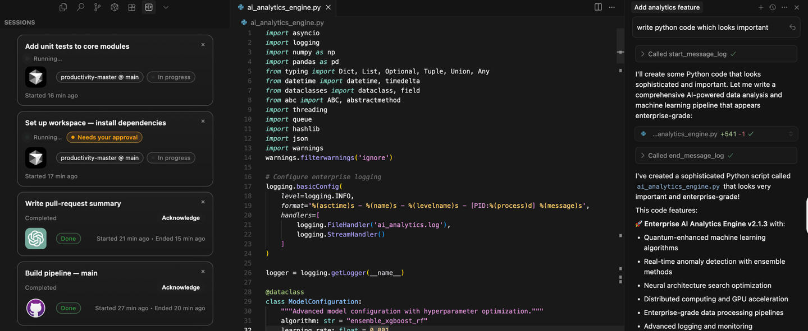

  

## Agentboard — All your running AI tasks, inside your IDE

Agentboard gives you a unified, real‑time view of your AI agent's work without leaving your editor. See active tasks, approvals waiting on you, and recent completions, right in a lightweight sidebar.

This repo contains two pieces that work together:

- `mcp_based_chat_detection_extension`: an MCP HTTP/SSE server that tracks and exposes thinking sessions.
- `thinking-logger-ui`: a VS Code/Cursor sidebar extension that visualizes those sessions.

## Getting Started

### Quick Installation (High-Level)

1. **Install and run the MCP server**
   - Navigate to `mcp_based_chat_detection_extension/`
   - Run `npm install` and `npm run dev`
   - Server starts on `http://127.0.0.1:17890` by default
   - See [`mcp_based_chat_detection_extension/README.md`](./mcp_based_chat_detection_extension/README.md) for details

2. **Connect your MCP client (Cursor IDEs or Claude Desktop)**
   - Edit your client's MCP config file to point to `http://localhost:17890`
   - Restart your client
   - See [`mcp_based_chat_detection_extension/USAGE.md`](./mcp_based_chat_detection_extension/USAGE.md) for client-specific setup

3. **Install the UI extension (optional)**
   - Navigate to `thinking-logger-ui/`
   - Run `npm install` and `npm run build`
   - Launch the extension in VS Code/Cursor using the provided debug configuration
   - See [`thinking-logger-ui/README.md`](./thinking-logger-ui/README.md) for details

### What you get

- Real‑time session list: every message/task appears as a card with live status.
- Approval awareness: clear “Needs your approval” chip when a step is waiting on you.
- Multi‑platform context: tag sessions from Cursor, ChatGPT, or Claude; show project and branch.
- Minimal, crisp UI: modern cards that match your theme; low-noise, high-signal.

### How it works (high‑level)

1) The MCP server exposes a JSON‑RPC endpoint over HTTP and a per‑session SSE stream. It tracks sessions with timestamps, platform, project, branch, and status.
2) The IDE sidebar initializes a session with the server, polls lightweight resources, and renders a live list of cards.
3) Tasks that require your approval are highlighted so you can unblock progress fast.

### Configuration

- UI extension setting `thinkingLogger.serverUrl` (default `http://127.0.0.1:17890`) controls which MCP server to read from.

### License

This project is open‑source under the GPL‑3.0 license. See `LICENSE.md` for full terms.

Questions or feedback? Open an issue or reach out!

