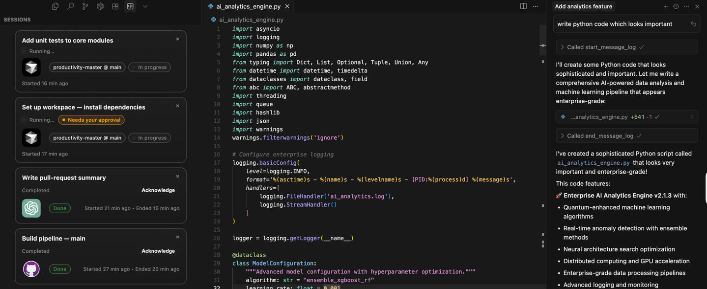

<p align="center">
  
</p>

<h2 align="center">Agentboard — All your running AI tasks, inside your IDE</h2>

<p align="center">
  <a href="https://github.com/idolaman/agentboard/blob/main/LICENSE.md"></a>
  <a href="https://marketplace.visualstudio.com/items?itemName=idolaman.thinking-logger-view"></a>
  <a href="https://open-vsx.org/extension/idolaman/thinking-logger-view"></a>
</p>

<p align="center">
  
</p>

<p align="center">
Stop alt-tabbing to check on your agents.<br/>
Agentboard gives you a unified, real-time view of every AI task — active, waiting on you, or just finished — right in your editor's sidebar.
</p>

---

### Why Agentboard?

You kicked off three Claude tasks, a Cursor agent is refactoring your auth module, and ChatGPT is drafting release notes. Which one is stuck waiting for approval? Which one just finished? Without Agentboard you're juggling tabs and terminals. With it, you glance at one sidebar and know exactly what's happening.

- **Live status cards** — every task shows up in real time with its current state
- **"Needs your approval"** — a bright chip tells you the instant an agent is blocked on you
- **Multi-platform** — Cursor, Claude Desktop, ChatGPT — all in one view, tagged by project and branch
- **Stays out of your way** — theme-aware, tiny footprint, zero config to get started

## Install

Grab it from your editor's marketplace — takes about 10 seconds:

| Editor | Link |
|---|---|
| **Cursor** | [Open VSX Registry](https://open-vsx.org/extension/idolaman/thinking-logger-view) |
| **VS Code** | [VS Code Marketplace](https://marketplace.visualstudio.com/items?itemName=idolaman.thinking-logger-view) |

Or visit the [landing page](https://betterdev.app/agentboard) for more info.

Once installed, open the **Thinking** view in the Activity Bar, paste your token (get one from the [setup guide](https://betterdev.app/agentboard)), and you'll see your sessions immediately.

## Self-Hosting

Want to run the backend yourself? The repo has two packages:

| Package | What it does |
|---|---|
| `mcp_based_chat_detection_extension` | MCP HTTP/SSE server that tracks thinking sessions |
| `thinking-logger-ui` | VS Code/Cursor sidebar extension |

### Get it running in ~2 minutes

1. **Start the MCP server**
   ```bash
   cd mcp_based_chat_detection_extension
   npm install && npm run dev
   ```
   Server starts on `http://127.0.0.1:17890`.
   See the [server README](./mcp_based_chat_detection_extension/README.md) for details.

2. **Point your MCP client at it**
   Add `http://localhost:17890` to your Cursor, VS Code, or Claude Desktop MCP config and restart.
   See [USAGE.md](./mcp_based_chat_detection_extension/USAGE.md) for copy-paste configs.

3. **Build the sidebar extension** (optional — or just install from the marketplace)
   ```bash
   cd thinking-logger-ui
   npm install && npm run build
   ```
   Then launch via the VS Code debug configuration.
   See the [extension README](./thinking-logger-ui/README.md) for details.

## How it works

```
MCP client (Cursor, Claude, …)
    │  JSON-RPC over HTTP
    ▼
MCP Server ──── SSE stream ────▶ Sidebar Extension
    │                                   │
    └─ sessions, status,                └─ renders live
       timestamps, branch                  card list
```

1. The MCP server exposes a JSON-RPC endpoint and a per-session SSE stream. It tracks sessions with timestamps, platform, project, branch, and status.
2. The sidebar connects, polls lightweight resources, and renders a live list of cards.
3. Tasks that need your approval are highlighted so you can unblock them fast.

## Configuration

| Setting | Default | Description |
|---|---|---|
| `thinkingLogger.serverUrl` | `http://127.0.0.1:17890` | MCP server URL the sidebar reads from |

## Roadmap

- [ ] Web ChatGPT integration
- [ ] Session analytics (tokens, duration, performance)
- [ ] Deep linking to specific sessions

Have an idea? [Open a feature request.](https://github.com/idolaman/agentboard/issues/new?template=feature_request.md)

## Contributing

Contributions are welcome! Check out [CONTRIBUTING.md](./CONTRIBUTING.md) for dev setup, coding guidelines, and the PR process.

## Support

- **Bugs & feature requests** — [open an issue](https://github.com/idolaman/agentboard/issues)
- **Landing page** — [betterdev.app/agentboard](https://betterdev.app/agentboard)

## License

GPL-3.0 — see [LICENSE.md](./LICENSE.md) for full terms.
