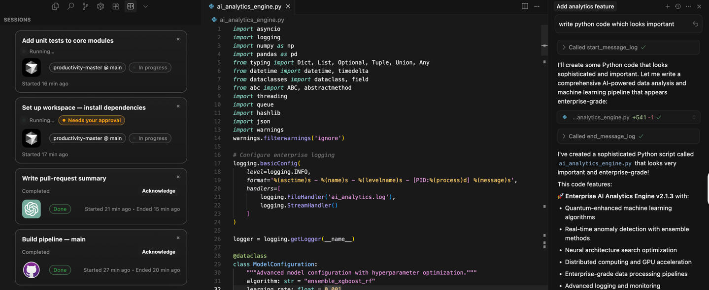

## Agentboard — All your running AI tasks, inside your IDE

Agentboard gives you a unified, real‑time view of your AI agent's work without leaving your editor. See active tasks, approvals waiting on you, and recent completions, right in a lightweight sidebar.

This repo contains two pieces that work together (GitHub mirror: https://github.com/idolaman/Agentboard):

- `mcp_based_chat_detection_extension`: an MCP HTTP/SSE server that tracks and exposes thinking sessions.
- `thinking-logger-ui`: a VS Code/Cursor sidebar extension that visualizes those sessions.

## Getting Started

### Quick Installation (High-Level)

1. **Install and run the MCP server**
   - Navigate to `mcp_based_chat_detection_extension/`
   - Run `npm install` and `npm run dev`
   - Server starts on `http://127.0.0.1:17890` by default
   - See the server's README in the workspace folder `mcp_based_chat_detection_extension/` for details

2. **Connect your MCP client (Cursor IDEs or Claude Desktop)**
   - Edit your client's MCP config file to point to `http://localhost:17890`
   - Restart your client
   - See the `USAGE.md` file inside `mcp_based_chat_detection_extension/` for client-specific setup

3. **Install the UI extension (optional)**
   - Navigate to `thinking-logger-ui/`
   - Run `npm install` and `npm run build`
   - Launch the extension in VS Code/Cursor using the provided debug configuration
   - See [Thinking Logger UI](#thinking-logger-ui-vs-code--cursor-extension) section below for details

### What you get

- Real‑time session list: every message/task appears as a card with live status.
- Approval awareness: clear “Needs your approval” chip when a step is waiting on you.
- Multi‑platform context: tag sessions from Cursor, ChatGPT, or Claude; show project and branch.
- Minimal, crisp UI: modern cards that match your theme; low-noise, high-signal.

### How it works (high‑level)

1) The MCP server exposes a JSON‑RPC endpoint over HTTP and a per‑session SSE stream. It tracks sessions with timestamps, platform, project, branch, and status.
2) The IDE sidebar initializes a session with the server, polls lightweight resources, and renders a live list of cards.
3) Tasks that require your approval are highlighted so you can unblock progress fast.

### Configuration

- UI extension setting `thinkingLogger.serverUrl` (default `http://127.0.0.1:17890`) controls which MCP server to read from.

### Roadmap

- VS Code Marketplace distribution
- Web ChatGPT integration
- Session analytics (tokens, duration, performance)
- Deep linking to specific sessions

### License

This project is open‑source under the GPL‑3.0 license. See `LICENSE.md` for full terms.

## Thinking Logger UI (VS Code / Cursor Extension)

A lightweight sidebar that displays running and completed "thinking" sessions from the Thinking Logger MCP server. Built with the VS Code Webview API and designed to blend with your editor theme.

### Requirements

- VS Code 1.89+ or Cursor
- Node.js 18+ (recommended 20+)
- A running Thinking Logger MCP server (default `http://127.0.0.1:17890`) — see `../mcp_based_chat_detection_extension`.

### Install dependencies

```bash
cd /Users/idolavi/Documents/Code/productivity-master/thinking-logger-ui
npm install
```

### Build

```bash
npm run build
```

Outputs compiled files to `dist/`.

### Develop / Run in VS Code

This repo includes a ready-to-use launch configuration.

1) Build once:

```bash
npm run build
```

2) In VS Code, open the workspace root and run the launch config:

- Run: `Run and Debug` → `Run Thinking Logger UI`
- Prelaunch task builds the extension and launches a new Extension Host window

3) In the Extension Host window, open the Activity Bar and select `Thinking` to view sessions.

### Configuration

Extension setting: `thinkingLogger.serverUrl`

- Default: `http://127.0.0.1:17890`
- Points to the MCP server base URL

### How it connects

On activation, the extension:

1) Sends an `initialize` JSON‑RPC request to the MCP server (`POST /`)
2) Receives a `mcp-session-id` header for the session
3) Periodically requests `resources/read` for `thinking://sessions`

### Troubleshooting

- Error "Failed to connect to MCP server":
  - Ensure the server is running and reachable at `thinkingLogger.serverUrl`
  - Confirm `mcp-session-id` is present in initialize response headers

- Empty list:
  - Verify the MCP server is receiving and storing sessions

